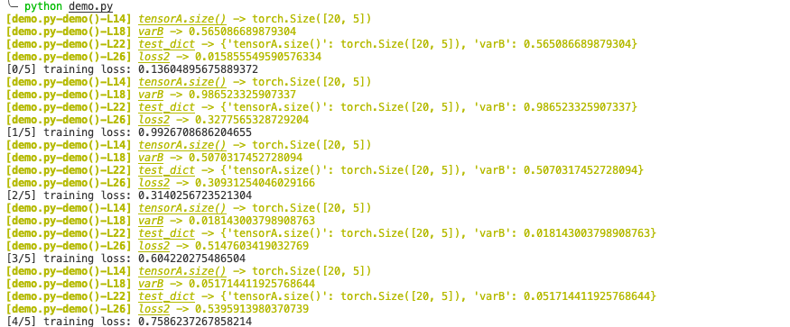

# python-dprint
debug print tool for deep learning studies in python.
        

# Why we need it? 
The built-in debugger is great, however, for some reason :upside_down_face:, we may still want to <b>print them out for debugging purpose</b>. For such scenarios, we would like it to have the following feats. (especially when running deep learning projects - where our monitoring/debugging variables are being updated within loops)

1. Context Info. We may like to display the <b>invoking positions</b> for these variables (to help us identify back each of them), including their file name, func name, and line number. 

2. Different Color. We may like it to be <b><font color="orange">clearly distinguishable</font></b> from tons of normal printings within loops, such as <i>displaying training loss</i>. The default color is YELLOW now, which could be custmozed in future releases soon (full color-code can be found [here](https://www.geeksforgeeks.org/print-colors-python-terminal/)).

4. Pass-Through Print. We may like to monitor things without breaking current code structure, i.e., <b>print-and-return</b>. Note: you can still simply ```dprint()``` them (just like print() in python) - it's compatible to both usecases :crossed_fingers:.
```
#loss = loss1 + loss2
loss = loss1 + dprint(loss2)
```
3. (Optional) Multiple Variables. We may <u>not</u> like to leave too much print() statement in our code - they look redundent - instead, we may like to display multiple variable within lines as less as possible (by passing them all as a dict).

# How we use it?
Very easy :innocent:
- Installation
```
pip install pydprint
```
- Import
```
from pydprint import dprint
```
- Demo Usecases: [demo.py](https://github.com/chaoyivision/python-deprint/blob/main/demo.py) (see some examples).

